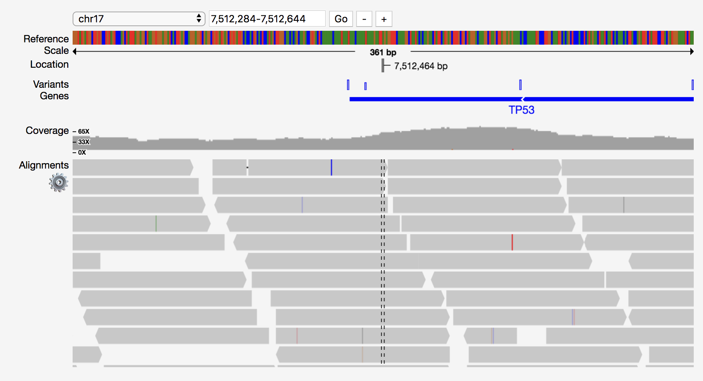

# React Genome Viewer

Genome viewer in React based upon Pileup.js

[](https://travis-ci.org/plotly/react-genome-viewer)




## Getting started


### Installation

For [yarn](https://yarnpkg.com/en/) users, run:

```
$ yarn add react-genome-viewer
```

For [npm](https://www.npmjs.com/) users, run:

```
$ npm install react-genome-viewer
```


### Usage

```js
import React from 'react';
import GenomeViewer from 'react-genome-viewer';

class App extends React.Component {
  render() {
    return (
        <GenomeViewer
            genomedata="http://www.biodalliance.org/datasets/hg19.2bit"
            trackdata="demo/data/synth3.normal.17.7500000-7515000.bam"
            trackindex="demo/data/synth3.normal.17.7500000-7515000.bam.bai"
            variantdata="demo/data/snv.chr17.vcf"
            genedata="http://www.biodalliance.org/datasets/ensGene.bb"
            range = {{
                contig: "chr17",
                start: 7512284,
                stop: 7512644
            }}
        />
    );
  }
}
```


## Development


### Testing locally

Get the code:

```
$ git clone https://github.com/plotly/react-genome-viewer
```

Install the project `dev` dependencies:

```
# Install dependencies
$ yarn

# Watch source for changes and build to `src/lib/`
$ yarn start
```

The React app demo should be available at: http://localhost:8080/.


### Build and releases

To build the production version of this library, run the command below, which
will create a `dist/` folder containing the required files:

```
$ yarn build
```

In order to release a new version, you can push a git tag and Travis-CI will
automatically publish a npm release at:
https://www.npmjs.com/package/react-genome-viewer. There is no need to run `yarn build` by yourself See the [`.travis.yml`](.travis.yml) for further information.


## Contributing

Thanks for your interest in maintaining the library!
Please see the [CONTRIBUTING](CONTRIBUTING.md) file.


## Contributor Code of Conduct

Please note that this project is released with a [Contributor Code of
Conduct](http://contributor-covenant.org/). By participating in this project you
agree to abide by its terms. See [CODE_OF_CONDUCT](CODE_OF_CONDUCT.md) file.


## License

react-genome-viewer is released under the MIT License. See the bundled
[LICENSE](LICENSE) file for details.
